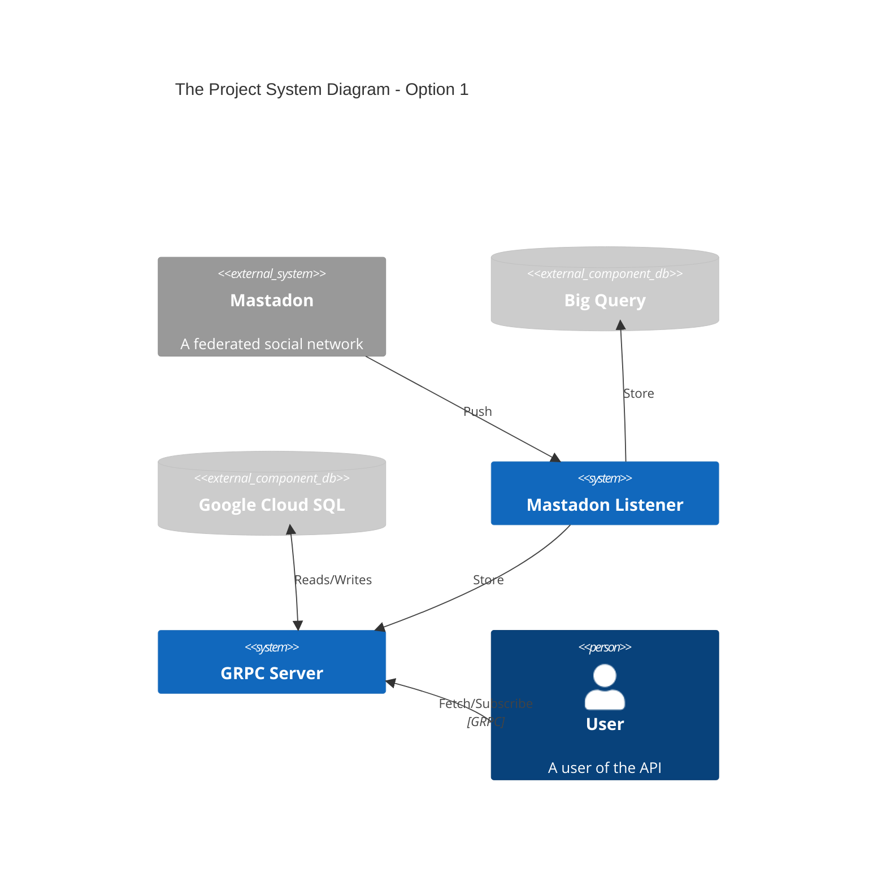

# The Project Architecture Decision Record

- Status: accepted
- Deciders: Arun Poudel (<fr3ak@fr3ak.me>)
- Date: 2023-11-13

## Context and Problem Statement

Some of the key requirements are:

- Stream Data from Mastadon
- Store Data in Big Query
- Provide a gRPC API to fetch/stream
 data

## Assumptions

Various assumptions made when designing options:

- We are a Google Cloud Workshop
- There might be requirement in future to have
multiple data sources (Currently only Mastadon Server)
- There might be requirement in future to have
multiple data sinks (Currently only Big Query and gRPC Service)

## Considered Options

### The Project System Diagram - Option 1

